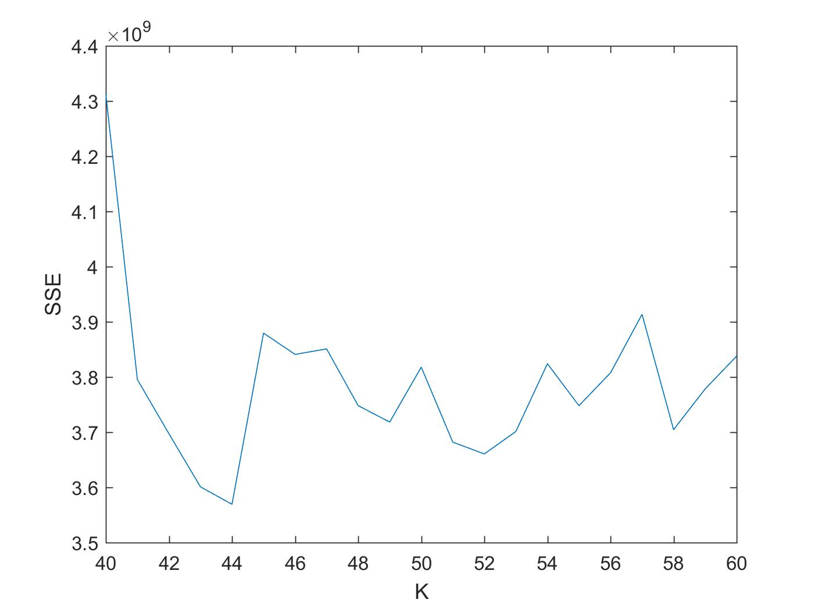

Assignment 5 (Group 16)
===============================================

**Andrei Isac (S3257053) - David Pavlov (S3187330) - Win Leong Xuan (S3208435)**

**Introduction to Data Science**

**December XX, 2016**

1. Agglomerative Clustering
----------------------------
For this assigment we have considered a combination of Matlab and R for their already build libraries. 

#### 1.1 Dificulties (Big dataset, Large distance matrix,too much computational time)
Beucause of the large dataset (330000 records) of the type double, the distance matrix (330000 x 330000) would be too large to store in memor. therefore we have sampled the data with the Matlab function `datasample`, which ensures random sapling of the data. The computational time for the `clusteddata` function is also to big for the whole dataset. 

#### 1.2 Solutions (uniformly sample from dataset, change linkage method to ward?)
We have sampled the data with the Matlab function `datasample`, which ensures random sapling of the data. The data used consists of 10% of the initial dataset. Of couser, different linkeade methods reflect different running times, the most offective one beeing the `ward`. (Please correct me if not.)
#### 1.3 
Well, the obvious difference between the 2 sets of data is that the 3d data represents points in space, while the 6d data represents points in space with their corresponding vector of speed and direction. 
The hopkins analysis was performed in this [*script*](Assign1.R) for both 3d and 6d data using R `clustertend` library. The results are:

`0.01340395` for the 3d data taking 1000 samples from the data set. 
`0.05771323` for the 6d data taking 1000 samples from the data set. 

The hopkins analysis is very computationally expensive, running it for 1000 samples took over 6 hours for each data set. Also these results are not favorable for clustering, both are less than 0.5 => the data is randomly distributed.

The matlab `evalclusters`matlab eval clusters

#### 1.4 Plots
![] (Rplot03.png)

#### 1.5 ,complete - larger variance between clusters , ward - 

2. K-Means Clustering
----------------------------
#### 2.1. Proof of convergence 
In order to prove the convergence of the K-Means algorithm let us first look at some of its properties:

1. There are kN possible assignments
2. On each iteration the closest point to a centroid is assigned to the cluster it represents
3. The positions of the centroids are recalculated
  
At each iteration the algorithm performs number of assignments. A point can be either assigned to a new cluster or left in the old one. As a result the centroid may change or may remain the same. If the centroid changes it reduces the distance to the members of the cluster it represents. Since there is a finite number of possible assignments the algorithm will either enter a cycle where individual points will switch between neighbour cluster (especially in case of high density data),in which case there will be small changes in the SSE for the different clusters, or will not change at all. Hence the algorithm will converge in finite time.

#### 2.2. Difference between 3D and 6D data
The following two plots represent the visual difference between the 3D and 6D data.

As it is seen from the figures the 3D data seems to be more dense on one of the sides and more scattered on the other. When the velocities are applied it is easy to see that the density which is observed on the 3D scatter plot is actually the galactic center. From the two plots it is easy to see that the 3D does not bring much visual information and one can not make many assumptions about the arrangement of the stars while the 6D gives much more clearer idea what each point in the data set represents and how it is positioned compared to the others.

#### 2.3. Best number of K 
In order to select the best possible K some evaluation should be performed. The most appropriate K would be the one that minimizes the summarized square error (SSE). In finding the most appropriate value of K the following steps were followed:
  1 10% of the original data is uniformly sampled.
  2 For K values ranging from 10 to 100, increasing with step 10 the KMeans method is applied.
  3 At the end of the clustering for each cluster size is calculated the SSE.
  4 The process is repeated 50 times for different initial prototypes in order to minimize initialization errors.
  5.The final value of SSE represents the average result from running the process 50 times for each cluster size.
  
After the above described process is complete there is an initial point for analysis. After plotting the 3D data it is easy to see that there is a drastic drop in SSE for clustering of size 40. After applying the elbow criterion it may be assumed that the optimal value of K is between 20 and 40. 

Thw following results are obtained by using kmeans++ initialization and squared euclidean distance : 

In order to get more precise results the next step is to explore this region. To get these results the above described iteration is repeated, this time for K in the interval between 20-40. The following plots shows the results from the iteration.
 

As a result the value of K which minimizes the value of SSE is 25 which is confirmed by the silhouette plot.
 

For the 6D data the it is 44.

#### 2.4. Different distances of measure
In order to achieve better results different measures can be used. The performance of the algorithm 
###Squared Euclidean

###Cosine
3D Data

6D Data

#### 2.5. Cluster prototype initialization
The initialization of the prototypes is of high importance in kmeans. A proper initialization may lead to faster convergence and better results.
There are different initialization methods such as : selecting k observations at random, selecting uniformly k observations at random, performing preliminary clustering of the data, etc.

###Cluster
3D Data

6D Data

###Sample
3D Data

6D Data

###Uniform
3D Data

6D Data

It is clear that each initialization method gives different results. In order to find the optimal one for given data set certain tests have to be made. Also depending on the data different methods have to be chosen in order to achieve the best possible results. For this particular data set the cosine similarity proves to be give best results.

3. Gaussian Mixture Model
----------------------------
<!--- test --->
